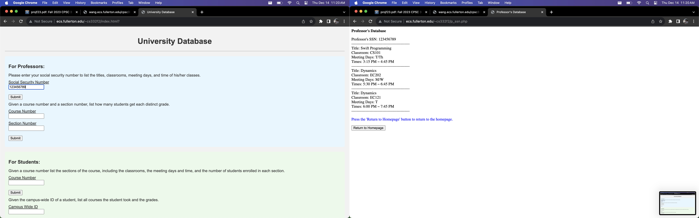

# Project Descriptions:
## You are asked to design a database for a university that satisfies the following requirements:
1. The database keeps information of each professor, including the social security number, name, address, telephone number, sex, title, salary, and college degrees. The address
includes street address, city, state, and zip code. The telephone number includes the
area code and 7 digit number.
2. Each department has a unique number, name, telephone, office location, and a chair-person who is a professor.
3. Each course has a unique number, title, textbook, units. Each course also has a set
of prerequisite courses. Each course is offered by a department.
4. Each course may have several sections. Each section has a section number that is
unique within the course, a classroom, a number of seats, meeting days, a beginning
time, an ending time. Each section is taught by a professor.
5. The database keeps student records, including the campus wide ID, name, address,
and telephone number. Each student majors in one department and may minor in several departments. The name includes first name and last name.
6. The database keeps enrollment records. Each record has a student, a course section,
and a grade.

## Design your database and create at least the following numbers of records:
1. 8 students  
2. 2 departments  
3. 3 professors  
4. 4 courses  
5. 6 sections  
6. 20 enrollment records

## You should provide interfaces for the following individuals:
### For the professors:
1. Given the social security number of a professor, list the titles, classrooms, meeting
days and time of his/her classes.  
2. Given a course number and a section number, count how many students get each
distinct grade, i.e. ‘A’, ‘A-’, ‘B+’, ‘B’, ‘B-’, etc.
### For the students:
1. Given a course number list the sections of the course, including the classrooms, the
meeting days and time, and the number of students enrolled in each section.  
2. Given the campus wide ID of a student, list all courses the student took and the
grades.
